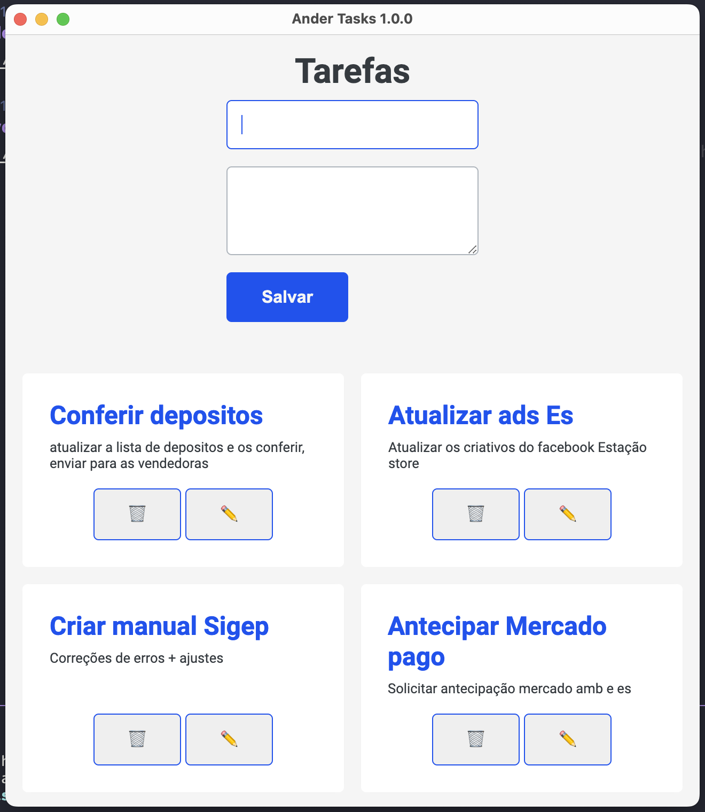

## Electron Mongodb CRUD

A desktop app to take notes using Electron.js, and Mongodb as database.

## Video tutorial youtube
https://www.youtube.com/watch?v=D67Liy5C86s

## Layout base
https://www.behance.net/gallery/77548409/brick-Mobile-Loan-Service



### Requeriments

- Nodejs
- Mongodb 

### Environment variables

```
MONGODB_URI
```

## Installation

```bash
yarn
yarn start
```